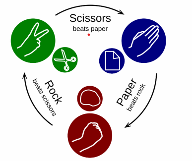

# The "Rock - Paper - Scissors" Game
A console-based JavaScript implementation of the "Rock - Paper - Scissors" game.

<a>Rock - Paper - Scissors</a> is a simple **two player game**, where you and your oponent (the computer) simultaneously choose one of the following three options: "**rock**", "**paper**" or "**scissors**". The rules are a follows:

- Rock beat scissors
- Scissors beats paper
- Paper beats rock

The **winner** is the player whose choise beats the choise beats the choice of his opponent. if both players choose the same option (e.g. "paper"), the game outcome is "draw".